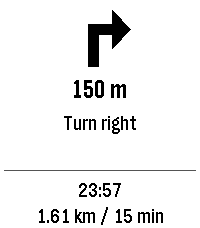

# YaNaviPeb

[English](README.md) | **Русский**

Пошаговая навигация из Яндекс Карт на часах Pebble Time 2.

Во время ведения по маршруту в Яндекс Картах часы показывают стрелку манёвра, расстояние до него,
текст манёвра («Поверните направо»), время прибытия, оставшийся путь и время в пути. Часы сами
открывают приложение, когда начинается навигация, и закрывают его после её окончания.

<p align="center">
  
</p>

Проект не связан с Яндексом и Core Devices и не использует их API: данные берутся из
навигационного уведомления, которое Яндекс Карты показывают на телефоне.

## Как это работает

Проект состоит из двух частей:

- **Android-приложение** (`android/`) читает уведомление Яндекс Карт через
  `NotificationListenerService`, достаёт из него расстояние, манёвр, время прибытия, остаток пути
  и иконку манёвра и отправляет на часы только изменившиеся поля, не чаще раза в секунду.
  Поля берутся из собственной разметки уведомления: приложение разворачивает его `RemoteViews`
  и находит поля по именам ресурсов view (`titleView`, `remainingDistanceView`, `timeOfArrivalView`,
  `primaryIconTinted` и т. д.). Если view с расстоянием или манёвром нет, используются стандартные
  заголовок и текст уведомления.
- **Приложение для часов** (`watchapp/`, C, Pebble SDK) принимает данные по AppMessage и рисует экран.

Связь идёт через официальное приложение Pebble (`coredevices.coreapp`) и библиотеку
PebbleKit 2 (`io.rebble.pebblekit2`). Стрелка не распознаётся по
таблице: на часы уходит сама иконка из уведомления (64×64, 1 бит), поэтому поддерживаются любые
манёвры, которые показывают Карты.

## Требования

- Часы Pebble. Проверено на Pebble Time 2 (платформа `emery`); приложение для часов также
  собирается с адаптивной раскладкой под все остальные платформы Pebble SDK (`aplite`, `basalt`,
  `chalk`, `diorite`, `flint`, `gabbro`), но на реальном железе проверена только `emery`.
- Android 11 или новее, приложение Pebble (`coredevices.coreapp`).
- Яндекс Карты (`ru.yandex.yandexmaps`) или Яндекс Навигатор (`ru.yandex.yandexnavi`) с включённой
  в его настройках «Фоновой навигацией» — без неё в уведомлении Навигатора нет данных о манёврах.
- Для русского текста на часах — языковой пакет с кириллицей, например «Кириллица (для уведомлений)»
  из приложения Pebble.

## Установка

Скачайте `app-release.apk` (Android-приложение) и `watchapp.pbw` (приложение для часов) из
[последнего релиза](https://github.com/DimaK21/YaNaviPeb/releases/latest) или
[соберите их из исходников](#сборка-из-исходников).

1. Установите `app-release.apk` на телефон. Приложение читает уведомления и ставится не из
   Google Play, поэтому система может заблокировать установку, см.
   [Устранение проблем](#устранение-проблем).
2. Установите `watchapp.pbw` на часы: откройте файл на телефоне в приложении Pebble.
3. Выполните настройку телефона ниже.

### Настройка телефона

1. Откройте YaNaviPeb и нажмите «Открыть настройки доступа к уведомлениям». Разрешите доступ. Если переключатель
   неактивен, см. [Устранение проблем](#устранение-проблем).
2. Отключите оптимизацию батареи для YaNaviPeb и для приложения Pebble, иначе система может
   остановить их в фоне.
3. Проверьте связь без поездки: кнопка «Запустить демо на часах» проигрывает записанный маршрут.
   Не запускайте демо во время настоящей навигации.

После этого достаточно начать ведение по маршруту в Яндекс Картах.

### Устранение проблем

- **Play Protect блокирует установку («App blocked to protect your device»).** Google Play Protect
  блокирует приложения, установленные не из Google Play, которые могут запрашивать чувствительный
  доступ, например к уведомлениям. Установите с компьютера командой
  `adb install -r app-release.apk` или временно отключите «Проверять приложения с помощью
  Play Protect» (Play Маркет → значок профиля → Play Protect → настройки), а после установки
  включите обратно.
- **Переключатель доступа к уведомлениям неактивен («Restricted setting»).** Android ограничивает
  чувствительные разрешения приложений, установленных не из Google Play. Откройте Настройки →
  Приложения → YaNaviPeb → меню ⋮ → «Разрешить ограниченные настройки», затем снова выдайте доступ
  к уведомлениям.

Названия пунктов меню отличаются в разных версиях Android и на разных оболочках.

## Сборка из исходников

### Android-приложение

Нужны Android SDK и JDK 21.

```bash
cd android
./gradlew :app:installDebug
```

`installDebug` ставит приложение на подключённый по adb телефон. Можно собрать APK командой
`./gradlew :app:assembleDebug` и установить файл `app/build/outputs/apk/debug/app-debug.apk` вручную.

### Приложение для часов

Нужен Pebble SDK 4.33.1 (утилита `pebble`) и Python 3.

```bash
cd watchapp
pebble build
tools/patch_appinfo.py
```

`tools/patch_appinfo.py` обязателен после каждой сборки. Он дописывает в `build/watchapp.pbw`
блок `companionApp`, который SDK 4.33.1 молча выбрасывает из `package.json`. Без этого блока
приложение Pebble не разрешит Android-приложению отправлять данные на часы.

Готовый `build/watchapp.pbw` установите на часы: откройте файл на телефоне в приложении Pebble
или выполните `pebble install --phone <IP телефона>` при включённом Developer Connection.

## Ограничения

- Название улицы и светофоры не показываются: в уведомлении Карт их нет.
- Формат уведомления Яндекс Карт не документирован и может измениться с обновлением Карт.
  Если часы перестали получать данные, в первую очередь стоит проверить именно это.
- Поддерживается только одна пара «телефон — часы».

## Разработка

```
android/                  Android-приложение (Kotlin, View Binding)
  app/src/main/.../nav/     чтение уведомления Яндекс Карт → NavState
  app/src/main/.../watch/   протокол и синхронизация с часами
  app/src/main/.../demo/    записанный маршрут для демо-режима
watchapp/                 приложение для часов (C, Pebble SDK)
  tools/                    патч appinfo, тестовые сообщения для эмулятора
```

Тесты Android-приложения:

```bash
cd android
./gradlew :app:testDebugUnitTest
```

Приложение для часов можно проверить в эмуляторе и отправить ему тестовый манёвр
(`right`, `left`, `straight` или `idle`; нужен Python 3 с Pillow):

```bash
cd watchapp
pebble install --emulator emery
tools/send_sample.sh right
```

В эмуляторе нет языкового пакета, поэтому кириллица там отображается квадратами.

### Протокол

Ключи AppMessage объявлены в `watchapp/package.json` (`pebble.messageKeys`) и нумеруются с 10000
в порядке массива. В Kotlin те же номера лежат в `Protocol.kt`, совпадение проверяет `ProtocolTest`.

| Ключ | № | Тип | Макс. байт | Пример |
|---|---|---|---|---|
| `STATE` | 10000 | uint8 | 1 | `0` — нет навигации, `1` — идёт |
| `DISTANCE` | 10001 | строка | 32 | `150 м` или фраза о прибытии вроде `Почти на месте` |
| `MANEUVER` | 10002 | строка | 48 | `Поверните направо` |
| `REMAINING` | 10003 | строка | 15 | `1,61 км` |
| `ETA` | 10004 | строка | 7 | `23:57` |
| `DURATION` | 10005 | строка | 19 | `1 ч 17 мин` |
| `ICON` | 10006 | байты | 512 | 64×64, 1 бит на пиксель |

Длина строк указана в байтах UTF-8 без завершающего нуля; телефон обрезает строки по границе
символа. Иконка: строки по 8 байт, старший бит первым, единица — белый пиксель.

## Лицензия

[0BSD](LICENSE): код можно использовать, изменять и распространять как угодно, без обязательного указания авторства.
